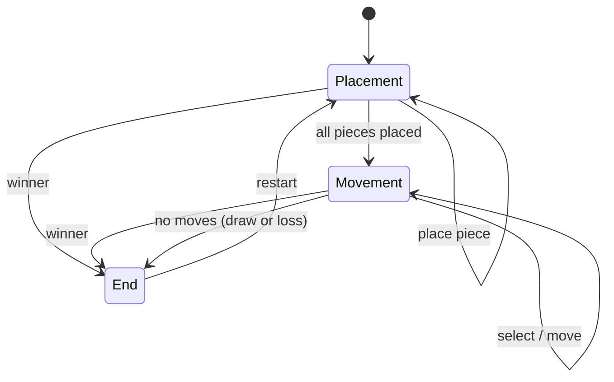

## Four in a Square (Arba BaRibua) — Architecture Scheme

Цель: сделать код **расширяемым** (правила/логика отдельно от UI), **тестируемым** (engine без React Native), и простым для добавления фич (анимации, подсказки, режимы).

---

## High-level слои

- **Game Engine (pure TS)**: правила игры, валидация ходов, победа/ничья, машина состояний.
- **UI (React Native)**: отрисовка доски, подсветки, обработка тапов, показ статуса.
- **State orchestration**: `useReducer` (или Zustand/Redux) в UI слое, но редьюсер использует функции engine.

---

## Дерево папок (предложение)

```
src/
  game/
    types.ts          # типы: Player, Phase, Pos, Board, GameState, Action
    engine.ts         # reducer + applyAction + immutable updates (pure)
    rules.ts          # win check, valid moves, no-moves, helpers
    mapping.ts        # индекс/координаты, соседние big squares, мини-координаты
  ui/
    components/
      BoardView.tsx   # 3x3 big squares, 2x2 slots, подсветка
      Header.tsx      # текущий игрок, фаза, restart
      Piece.tsx       # фишка (цвет, выбранность)
      Slot.tsx        # слот (нажатие, состояние)
    theme.ts          # цвета/размеры/константы стилей
  screens/
    GameScreen.tsx    # сборка UI + состояние через reducer
App.tsx              # просто рендер GameScreen
```

Минимальная версия может жить и в `App.tsx`, но это “сложно расширять” — лучше сразу разнести.

---

## Model данных

### Координаты
- **Big square**: индекс 0..8 (3×3)
- **Mini slot** внутри big: индекс 0..3 (2×2)
- Позиция фишки: `Pos = { bigIndex, slotIndex }`

### Доска
- `Board`: 9 big клеток × 4 слота.
- Тип слота: `null | 'R' | 'B'`.

Рекомендуемый формат:
- `board[bigIndex][slotIndex] => SlotValue`

---

## Машина состояний (game flow)



---

## Actions (что приходит из UI)

Минимальный набор действий:
- `restart`
- `pressSlot(bigIndex, slotIndex)`

Расширяемый набор (если нужно больше контроля):
- `selectPiece(pos)` / `clearSelection()`
- `moveSelected(toPos)`
- `setPiecesPerPlayer(n)`

